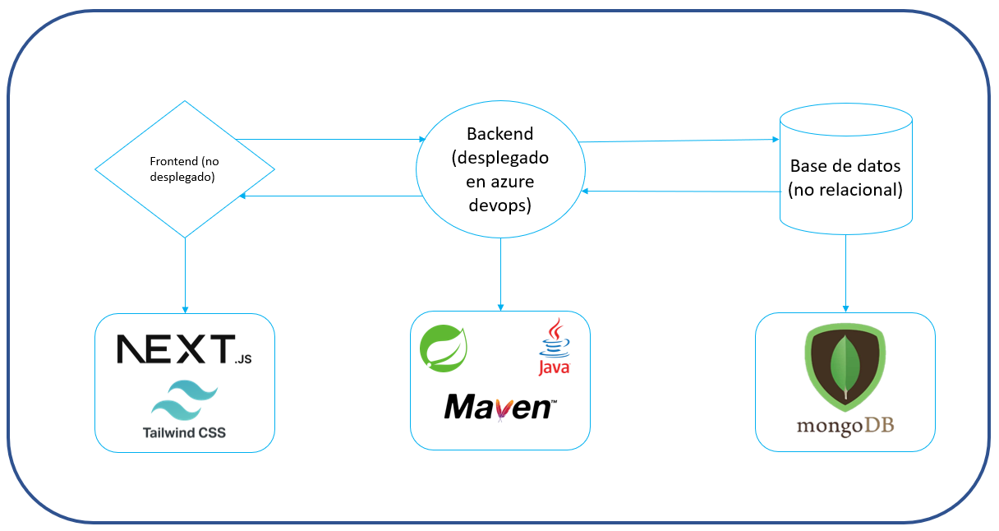
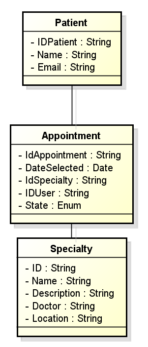
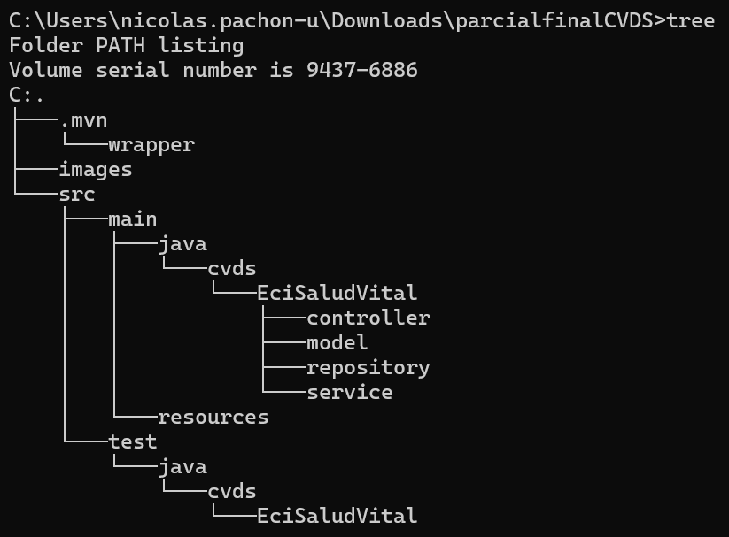

# Backend Eci Salud Vital

**Autor:** Nicolás Pachón Unibio

### Diagramas

En esta ocasion Se realizara un backend para el cumplimiento de las actividades solicitadas por Eci Salud vital, el cual contara con los siguientes componentes:

asimismo para la forma en la que se estructuran las clases sera del siguiente modo:

Con esto, se procedio a hacer uso de springboot initializr para crear la base del proyecto a trabajar, el cual se creo con el siguiente scafolding:

